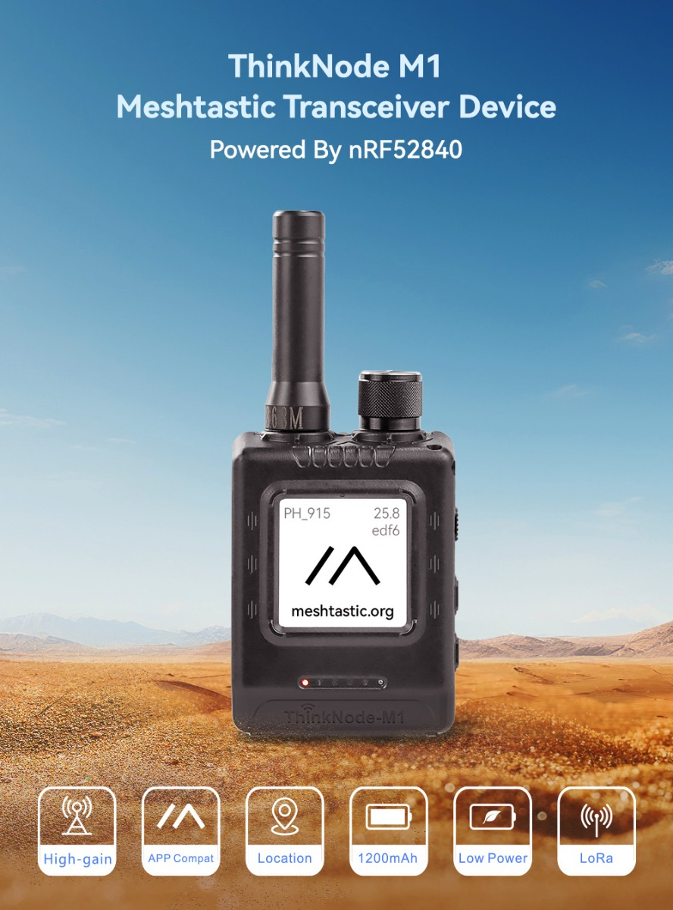
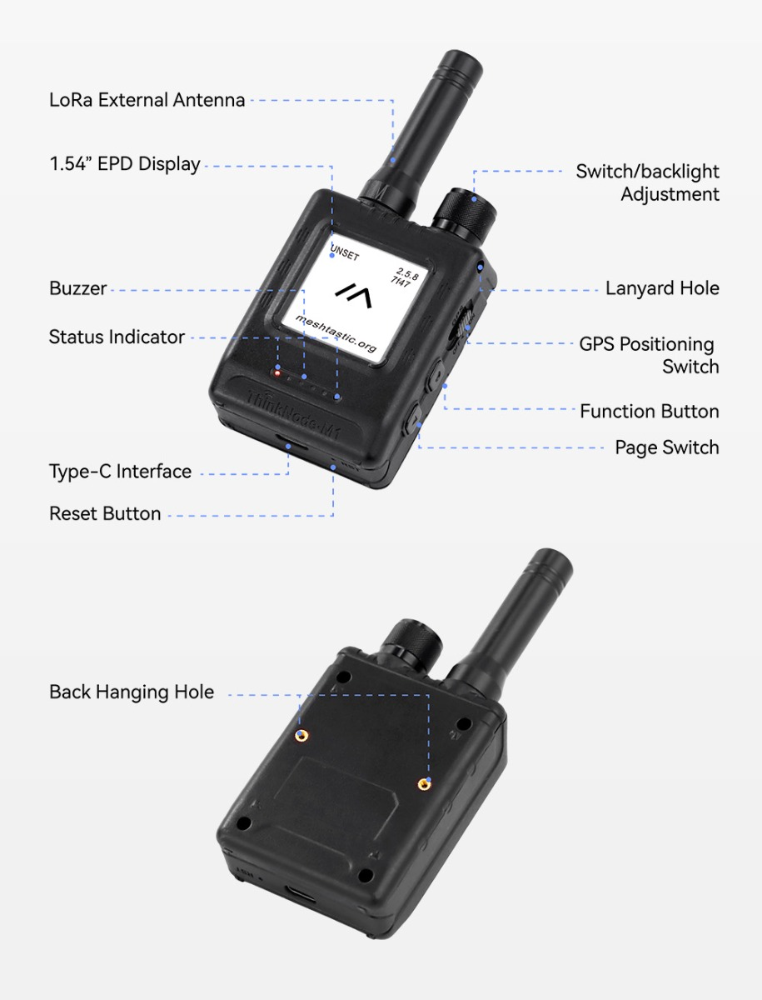

### 1, Product picture

https://www.elecrow.com/thinknode-m1-meshtastic-lora-signal-transceiver-powered-by-nrf52840-with-154-screen-support-gps.html

### 2, Product version number

|      | Hardware | Software | Remark |
| ---- | -------- | -------- | ------ |
| 1    | V1.0     | V1.0     | latest |

### 3, product information

| Main Processor（Nordic nRF52840） |                                                              |
| --------------------------------- | ------------------------------------------------------------ |
| CPU/SoC                           | 32-bit Arm® Cortex™-M4 CPU at 64 MHz with FPU (Floating Point Unit) |
| System Memory                     | 256 KB RAM                                                   |
| Storage                           | 3 MB Flash memory (external 2M Flash chip)                   |
| Firmware                          | Meshtastic firmware is fully compatible, and the signal is transmitted in LoRa mode |
| Display                           |                                                              |
| Size                              | 1.54 inch-EPD(monochrome ink screen)                         |
| Display Materials                 | E-lnk（Electronic Ink）                                      |
| Resolution                        | 200*200 or more                                              |
| Driver Chip                       | SSD1681 (Via SPI or I2C interface)                           |
| Global Fresh Time                 | 2s                                                           |
| Wireless Communication            |                                                              |
| Bluetooth                         | Bluetooth Low Energy and Bluetooth 5(phone configuration)    |
| LoRa                              | SX1262 LoRa Transceiver、US 915MHz/EU 868MHz(External antenna) |
| Hardware                          |                                                              |
| Interface                         | Type-C Interface、SMA Interface                              |
| Function                          | GPS Location(GPS, GLONASS, BeiDou, QZSS)、EPD Display、RTC、USB2.0、 PMU power management (built-in 1200mAh lithium battery), buzzer, etc. |
| Button                            | Knob Switch, Function Button, Toggle Button, GPS Switch, Reset Button |
| LED Indicator                     | Power supply, GPS/LoRa indication                            |
| Other                             |                                                              |
| Power Input                       | 5V/1A, supports USB or lithium battery power supply          |
| Power consumption                 | The maximum working current is about 85mA (CPU+LoRa transceiver), and the low power consumption is about 5.6μA |
| Operating Temperature             | -10~50°C                                                     |
| Storage Temperature               | -20~60 °C                                                    |
| Relative humidity                 | 10%-95%, @ 40°C (non-condensing)                             |
| Size                              | 82\*51.6\*26.3m                                                |
| Shell                             | ABS Plastic                                                  |
| Net weight                        | 58g (Without case); 81g (With case)                          |

### 4,Folder structure.

|--Datasheet: Includes datasheets for components used in the project, providing detailed specifications, electrical characteristics, and pin configurations.

|--example: Provides example code and projects to demonstrate how to use the hardware and libraries. These examples help users get started quickly.

|--factory_firmware: Stores pre-compiled factory firmware that can be directly flashed onto the device. This ensures the device runs the default functionality.

### 5,Hardware Overview

